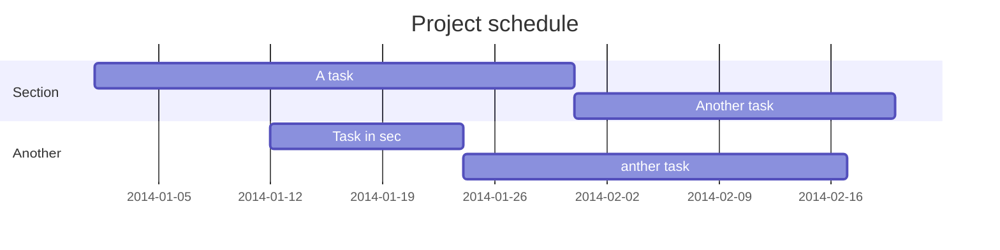

### 文件
- [Obsidian 1.0新手教學—打造個人知識管理利器，專屬的第二大腦 (2022年)](https://jdev.tw/blog/7745/obsidian-v1-0-introduction-2022)
- [中文教學](https://publish.obsidian.md/help-zh/%E4%BD%BF%E7%94%A8%E6%8C%87%E5%8D%97/%E5%B5%8C%E5%85%A5%E6%96%87%E4%BB%B6)

### 影片

<iframe width="640" height="360" src="https://www.youtube.com/embed/Egj_DdGUIDI" title="天哪我給大腦開外掛了！它完全顛覆了大家對筆記軟體的認知 | Obsidian 教學" frameborder="0" allow="accelerometer; autoplay; clipboard-write; encrypted-media; gyroscope; picture-in-picture; web-share" allowfullscreen></iframe>

<iframe width="481" height="356" src="https://www.youtube.com/embed/X2EnNG3Encg" title="Obsidian 入門必知必學 - 1" frameborder="0" allow="accelerometer; autoplay; clipboard-write; encrypted-media; gyroscope; picture-in-picture; web-share" allowfullscreen></iframe>
<iframe width="482" height="361" src="https://www.youtube.com/embed/8OP5Hy1u3wA" title="Obsidian 入門必知必學 - 2" frameborder="0" allow="accelerometer; autoplay; clipboard-write; encrypted-media; gyroscope; picture-in-picture; web-share" allowfullscreen></iframe>

### LaTex 數學公式

推广到更为一般的场景，基于参数$\theta$，样本$X_i\left( i=1,2,...n \right)$出现的概率为$P_i(\theta ;X_i)$，似然函数的一般形式可以用下面公式来表示，即各个样本发生的概率的乘积。
$$
L(\theta ;X)=P_1(\theta ;X_1)\times P_2(\theta ;X_2)...\times P_n(\theta ;X_n)=\prod{P_i}(\theta ;X_i)
$$

### 時程表

### 訊息流圖

CBTI 疗法

1. 把脑海中的念头写下来，问自己：我担心的问题是什么？它会造成什么样的后果？
2. 评估概率：按照你过往的经验和客观的看法，这些事情发生的概率有多高
3. 其他分支：除了这些你担心的后果，这些事情还有什么其他的可能性？
4. 考虑反例：在你过往的经验中，有多少事情是你担心会发生、但最后完全没有发生的？有多少事情是你担心很严重、但到头来很简单就解决掉了？
5. 列出帮助：万一你担心的事情真的发生了，你可以从哪些人、哪些途径获得帮助？

### 連結文件

[ABS_Test_Tracking_list](file:D:\ToOnedrv\Wc_Tektro\Udrv\Project\ABS\AS10\G測試\2024輪速車速測試\ABS_Test_Tracking_list.xlsx)

### 連結圖片

直接將圖片拖曳過來就可以
![[38kph下坡輪速跳動.jpg]]

### 插入表格

使用Ctrl + P -> 選擇 insert table

| 日期  | 版本  | 作者  | 說明         |
| --- | --- | --- | ---------- |
|     |     |     | 1234567890 |
|     |     |     |            |

