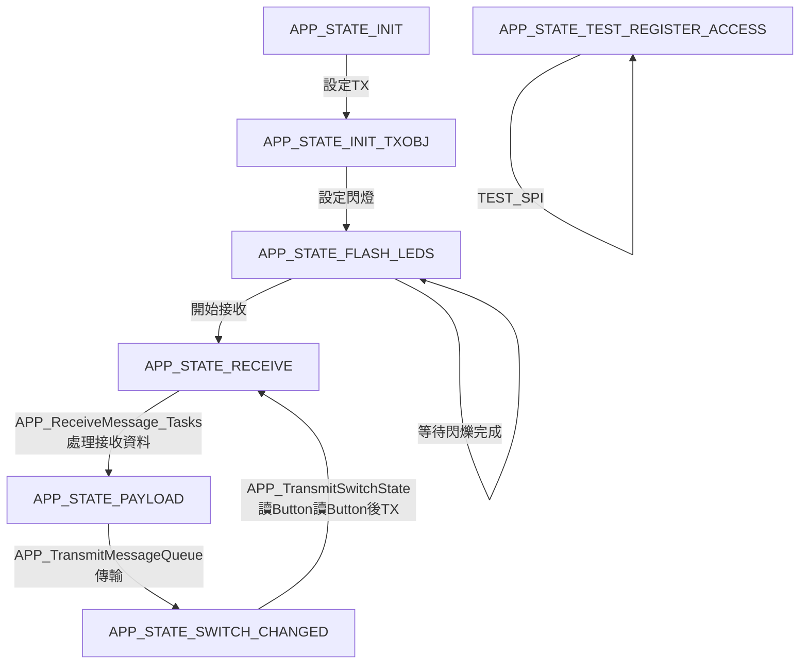

---
slideOptions:
  transition: slide
---

# API 檔案架構與設計分析
###### tags: `設計架構` `MCP25625` `SAM_V71`

---

## 參考資料
[MCP25625 Datasheet](https://ww1.microchip.com/downloads/en/DeviceDoc/MCP25625-CAN-Controller-Data-Sheet-20005282C.pdf)

----

MCP25625 SAMV71 V1.0版本

---

## Table of Contents
[TOC]

---

## 專案說明 <V71_CANSPI>    MCU <-SPI-> MCP25625 <-CAN->
This is an example project that uses the MCP25625 API together with the ATSAMV71Q21 processor in Atmel Studio.
* CAN messages are transmitted when switch SW0 is pressed.
* LED0 and LED1 can be controlled by CAN messages.

----

* The MCP25625 API files can be found in "driver\canspi".
* The API uses the processor specific SPI functions DRV_SPI_Initialize(), and DRV_SPI_Transfer() to interface with the MCP25625.
* The definition of the CAN messages can be found in Demo.dbc.

---

## 檔案架構

---

### 從Main開始看主流程
主要流程會在APP_Taks():

----

### 流程圖

> Read more about mermaid here: http://mermaid-js.github.io/mermaid/
!! APP_ReceiveMessage_Tasks() 名為Receive但是實際上是先收再送

---

## 分析
### <spi設定>
/driver/spi: drv.spi.c/h    ==SPI硬體設定==

---

### <傳送SPI命令給MCP25625送CAN: CAN SPI Driver>
/drive/canspi: drv_canspi_api.c/h    ==Drivers==

----

#### MCP25625 SPI instruction set

----

#### MCP25625 SPI instruction set

---

### CAN SPI Operation APIs 
drv_canspi_defines.h  ==API Defines Header File==
* DRV_CANSPI_Reset
* DRV_CANSPI_OperationModeGet
* DRV_CANSPI_OperationModeSelect
* DRV_CANSPI_ConfigurationSet
* DRV_CANSPI_TransmitChannelLoad

----

* DRV_CANSPI_TransmitChannelFlush
* DRV_CANSPI_FilterConfigure
* DRV_CANSPI_MaskConfigure
* DRV_CANSPI_ReceiveMessageGet
* DRV_CANSPI_ReceiveConfigurationSet
*........

---

### CAN SPI Regs 
drv_capspi_register.h ==Register Header File==
* DRV_CANSPI_REG_CANCTRL
* DRV_CANSPI_REG_CANSTAT
* DRV_CANSPI_REG_CNF1/2/3
* DRV_CANSPI_REG_TXBNCTRL

----

* DRV_CANSPI_REG_TXRTSCTRL
* DRV_CANSPI_REG_TXBnSIDL
* DRV_CANSPI_REG_TXBnDLC
* DRV_CANSPI_REG_RXBnSIDL
* .........

---

END

