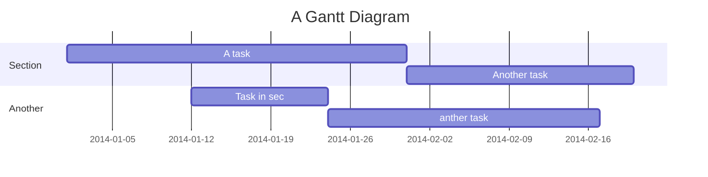

I2C Slave 接收 (from Master)
===


<style>
.blue {  color: blue; }
.red  {  color: red;  }
</style>


[TOC]
## 已知問題/現狀說明
#### 
- [x] Master 來源不穩定，待解決後再繼續確認
- [x] I2C Slave 傳送 (to Master) 未完成


## I2C Slave 接收 p.323
 
#### 
- [x] i2c slave mode operation p.327
- [x] 設定 7-bit Addressing Mode


Slave Reception Regs
---


### AHEN? DHEN? SEN?   p.359


#### 
- [x] 設定  <span class="blue">SSP1CON1</span> = 0
- [x] 設定 <span class="red">SSP1CON2</span> = 6
- [x] 設定 <span class="blue">SSP1CON3</span> = 0

Slave 接收流程圖
---

```sequence
Master->Slave: S detect, SSPxIF =1 
Note right of Slave: SDA Low
Slave-->Master: SSPxIF =1
Note left of Master: responds
Master->Slave: Send address

```

Slave Trasmission p.333
---


User flows
---
```sequence
Alice->Bob: Hello Bob, how are you?
Note right of Bob: Bob thinks
Bob-->Alice: I am good thanks!
Note left of Alice: Alice responds
Alice->Bob: Where have you been?
```

> Read more about sequence-diagrams here: http://bramp.github.io/js-sequence-diagrams/

Project Timeline
---


> Read more about mermaid here: http://mermaid-js.github.io/mermaid/

## Appendix and FAQ

:::info
** 有問題請留言!!
:::

###### tags: `PIC16LF18345` `周邊設定`
